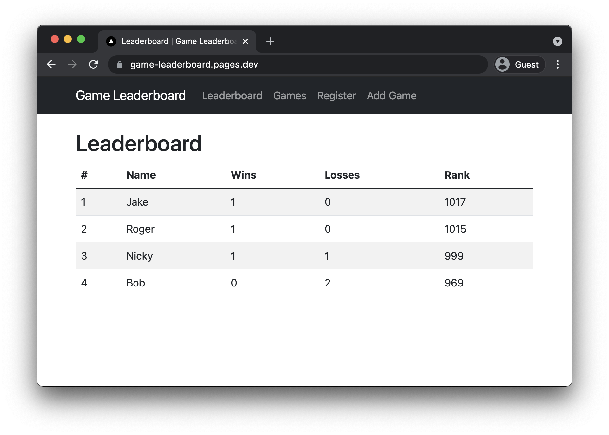
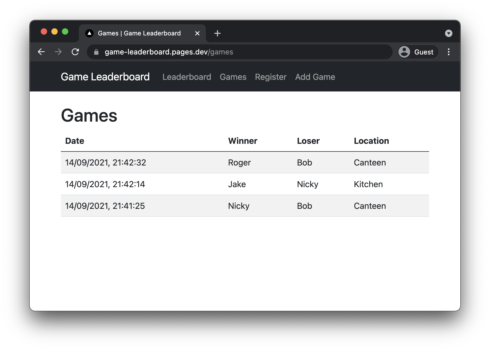

# Game Leaderboard

A simple web app for recording office pool, table tennis, football table or other games.

This project utilises [Cloudflare Workers](https://workers.cloudflare.com/), [Cloudflare Workers KV](https://developers.cloudflare.com/workers/runtime-apis/kv) and [Cloudflare Pages](https://pages.cloudflare.com/) to create a lightning fast, serverless leaderboard which can be run for free.

The client, hosted on Pages, is written using [Next.js](https://nextjs.org) and makes requests to the Worker. The Worker retreives [GraphQL](https://graphql.org) requests and stores data in Workers KV.

## Demo

A live demonstration of the project is available at <https://game-leaderboard.pages.dev>!

The Worker is available at <https://game-leaderboard.jakew.workers.dev> if you fancy playing with that.

## Screenshots

## Development and Deployment

For instructions on developing or deploying the project, look at the [Worker readme](./worker/README.md) and [client readme](./client/README.md) for details on setting up each.
